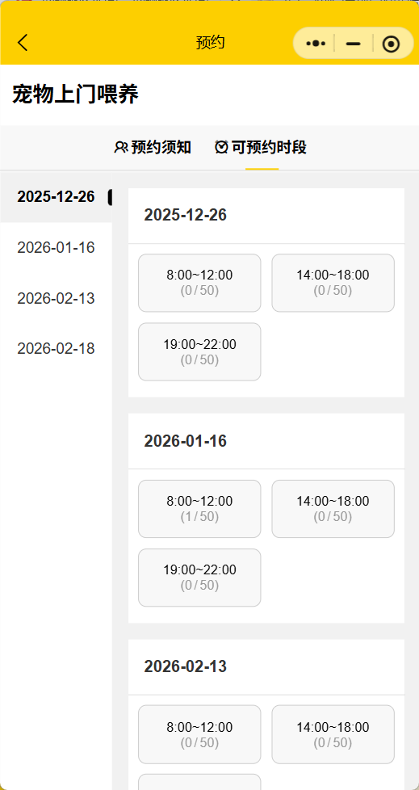

# 宠物上门服务小程序源码

 **需要源码或者技术支持请联系微信：** 

宠物服务小程序JAVA+Springboot：提供便捷的宠物服务预约平台， 帮助萌宠预约洗护、上门遛狗狗，上门喂猫，驱虫给药等；主要功能包括：展示不同服务，选择日期和时间，完成服务预约，用户查看历史订单和预约状态等

用户角色：查看服务类型信息、服务信息、查看预约记录，出示核销码等
管理员角色：管理服务、查看所有预约记录、核销预约、管理用户等
预约管理：开始/截止日期人数均可灵活设置
预约凭证：支持线下到场后校验签到/核销方式
详尽的预约数据：支持预约名单数据导出Excel，打印

#### 获取源码
关注公众号(成都悟软软件有限公司）回复：宠物小程序

 
 

技术支持或者定制开发请联系v:qq2facai

 

